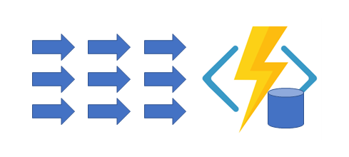

# :gem: Serverless

#### L'écosystème serverless (20 minutes)
- Cloud
- Open Source
- Framework
#### Les pratiques et paradigmes associés
#### Avantages / Inconvénients
#### Azure Function (40 minutes)

---
<!-- _class: center-headings -->
# Stateless

---

# :tomato: Lambda Specs​ 1/2

|Runtime|Versions|
|:---:|:---:|
| Node.js | 12.13.0, 10.16.3, and 8.10|
|Java     |11 and 8|
|Python|3.8, 3.7, 3.6, and 2.7|
|.NET Core| 2.1|
|Go| 1.x|
|Ruby| 2.5|
|Rust| n/a |

---

# :tomato: Lambda Specs​ 2/2

|Key|Value|
|:---:|:---:|
|AMI| 64-bit Amazon Linux|
|Memory| 128MB - 3008MB, in 64 MB increments​|
|Ephemeral disk space| 512MB​|
|Max execution duration| 900 seconds​|
|Compressed package size| 50MB​|
|Uncompressed package size| 250MB|​

---
<!-- _class: center-headings -->
# Application Patterns

---

<!-- _class: center -->

## Pattern #1: Function Chaining

## Pattern #2: Fan out/fan in

---
<!-- _class: center -->
## Pattern #3: Async HTTP APIs

---
<!-- _class: center -->
## Pattern #4: Monitor

---
<!-- _class: center -->
## Pattern #5: Human interaction

---
<!-- _class: center -->
## Pattern #6: Aggregator (stateful entities)

